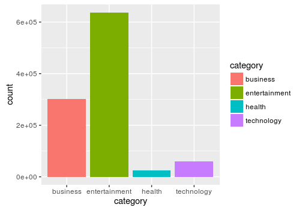
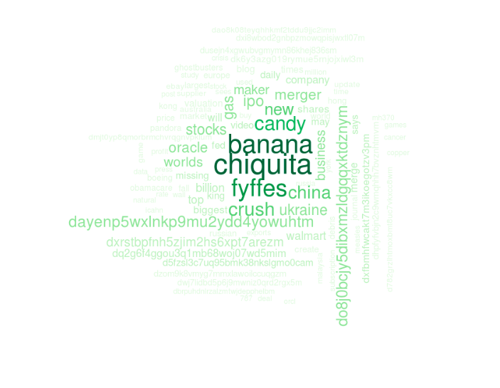

```{r setup, include=FALSE}
knitr::opts_chunk$set(echo = FALSE)
```

## Data Visualization Project

Goals: Do an exploration of a dataset

*The absence of an insight is an insight -CPM-*

## Choosing the Dataset

**Thought Process**

- UCI Repository
- Rationale for my dataset
- Moving forward with the dataset

## Merging the two datasets {.columns-2}

```html
**Important**
- clusterid
- category
- timestamp
```
```
**Less important**
- Publisher
- hostname
- URL
```

## Initial Mapping



##Time Difference from First to Last Occurence
-goal: to see the effects of virality regarding certain news

-result:


```html
Last Occurence - First Occurence = Time Difference of 0!!!
```


## Wordcloud!

```
insert magical code and 24 hours of life here
```

## Business Wordcloud 



## Entertainment Wordcloud 


## Technology Wordcloud 


## Health Wordcloud 


## Future Questions

- Is there a reason Entertainment is so high?
- Which Publishers post substatial news?
- Political Divide due to echo chamber?


