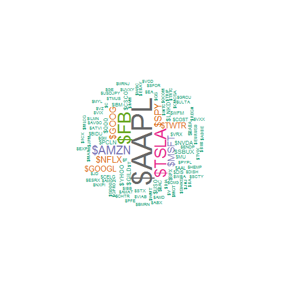
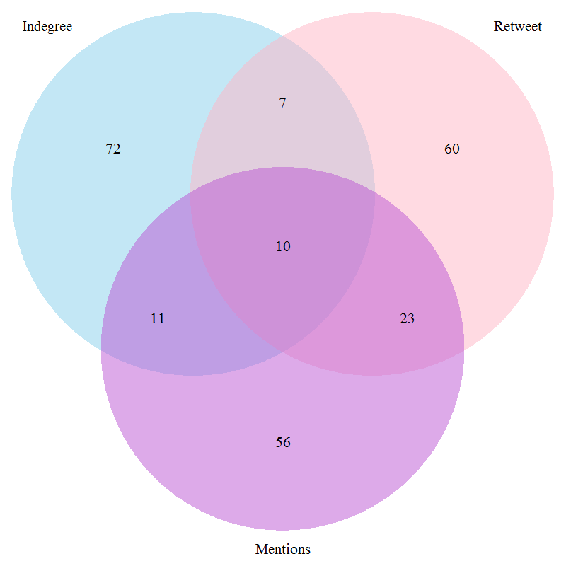
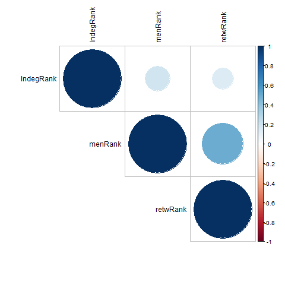
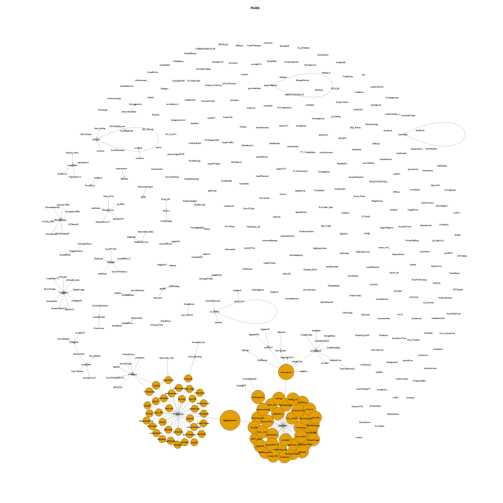
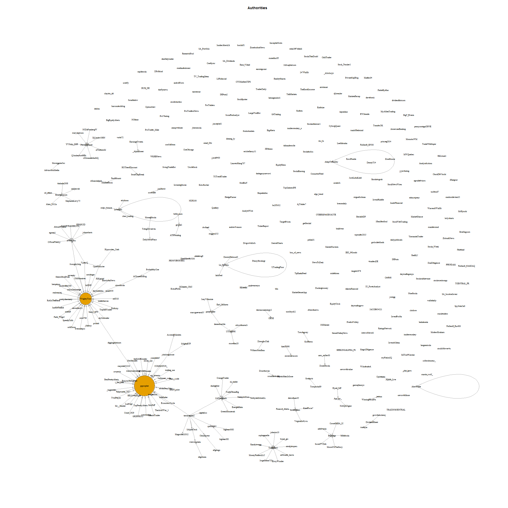

```{r setup, include=FALSE}
knitr::opts_chunk$set(echo = FALSE)
```

```{r libraries, include=FALSE}
library(dplyr)
library(lubridate)
library(knitr)
library(igraph)
```

***

##About the Dataset

* Source:
       + [Follow The Hashtag](http://followthehashtag.com/datasets/nasdaq-100-companies-free-twitter-dataset/)
* Measured time:
       + From 2016-Mar-28 to 2016-Jun-15
       + 79 days
* Format: 
       + 6 Excel files per company
* Twitter Stream: 
       + Included in "Dashboad" file in Sheet named Stream
       + Retweets are included in this datasets
* Size: 
       + 178 Mb (compressed)

***

## Questions

As a network analysis, I wanted to find out the following:

* Who are the top influentials?
* Who is the most influential user?
* Which stocks are the most influential users talking about?
* Which events caused the most chatter?

***

## Preparing the Dataset

### xlsx2csv

+ A python utility which easily converts xlsx files to csv. Supports conversion of xlsx files with multiple sheets. 

+ Can be automated using bash scripting.

+ [for more info](https://github.com/dilshod/xlsx2csv)

***

## The Dataset

### Dataframe attributes
```{r load all stream, include=FALSE}

stream <- readRDS("allStream.RDS")

```

```{r df_attrib}

dim(stream)

```
* Relevant columns
    + Tweet ID - int, unique tweet identifier
    + Date, Hour - date, date and time of tweet
    + Nickname - char, twitter username
    + Tweet content - char
    + RTs - int, number of times retweeted
    + Followers - int, number of followers
    + Is a RT - logical, TRUE == retweet
    + User Mentions - char, other usernames mention in the tweet content
    + Symbols - char, NASDAQ symbols in the tweet content
    
### Number of unique users (based on Nickname)

```{r unique users, echo=FALSE}

length(unique(stream$Nickname))

```

### Number of unique tweets (based on Tweet Id, RTs recieve a unique Tweet ID too)

```{r unique tweets, echo=FALSE}

length(unique(stream$`Tweet Id`))

```

***

## The Most Talked About Stock

A wordcloud derived from the whole stream was generated to show the most talked about stock.

**Figure 1. Wordcloud of the frequestly mentioned stock symbols.**  


***

## Significant Events

When was there the most tweets?

The plot below shows the distribution of tweets and retweets during the course of the observation.

**Figure 2. Frequency plot over the whole stream.**  


Verifying by code, we get the date with the most tweets as,

```{r day of max tweet}
twperday <- stream %>% group_by(.,Date) %>% dplyr::summarise(.,Tweets=n())

maxday <- twperday[which.max(twperday$Tweets), ]

```

### Day of Max Tweets

At what time during `r month(maxday[[1]], label = T)` `r day(maxday[[1]])` did users tweet?

**Figure 3. Frequency plot of the day of maximum tweet count.**  


***

## Measure of Influence

Three measures of influence [^1] :

1.  Indegree influence.
    + The number of people who follow a user.
    + Directly indicates the audience size of the user.
2.  Retweet influence.
    + The number of times others "forward" a user's tweet.
    + Represents the ability of the user to create content with pass-along value.
3.  Mention.
    + The number of times others mention a user's name.
    + Represents the ability of the user to engage others in a conversation.

[^1]: *Measuring User Influence in Twitter: The Million Follower Fallacy, Cha, Haddadi, Benevenuto, Gummadi. 2010*

***

## How Ranking Was Done

[Fractional rank](https://en.wikipedia.org/wiki/Ranking)

*  Rank of 1 is given to the most influential user and increasing rank indicates a less influential user. Users with the same influence score recieves the average of the rank amongst them.

***

### Deriving Indegree influence rank

Select relevant columns:
* Nickname - twitter username
* Followers

```{r indegrank}
indegRanked <- readRDS("indegRanked.RDS")
head(indegRanked)

```


***

## Deriving Retweet influence rank

* Filter to get tweets with unique Tweet ID.

* Select relevant columns:
    + Nickname
    + Is a RT - logical
    + RTs - integer count of the number of times the tweet was retweeted


```{r rtrank}
retwRanked <- readRDS("retwRanked.RDS")
head(retwRanked)

```

***

## Deriving Mention influence rank

* Filter to get tweets with unique Tweet ID & Is NOT a RT

* Select relevant columns:
    + Nickname
    + User Mentions - char string which lists the usernames mentioned in the tweet


```{r menrank}
mentionRanked <- readRDS("mentionRanked.RDS")
head(mentionRanked)

```

***

## The Top Influentials

```{r top influentials}
topInf <- readRDS("topInfTable.RDS")
kable(topInf[1:30, ], caption = 'Top 30 Influencers per Category')

```

Marginal overlaps were observed in these three top lists. The top `25` lists only had one user in common, `WSJ`

***

**Figure 4. Venn diagram of the top 100 influentials across measures.**  


The top 100 lists also showed marginal overlap.

***

## Spearman's Correlation Coefficient

What rank matters the most?

The correlation done on the top influential users show a stronger correlation in their retweet influence and mention influence.

**Figure 5. Correlation plot across measures.**  


This means that in most cases, users who are retweeted often are also mentioned often, and vice versa.

***

## Network Graph

Creating a network object of the whole twitter stream involves the following data frames:

* Nodes - or vertices. In this case, all unique twitter users.
* Edges - or links. In this case, retweets and mentions.

Nodes and edges may have weights.

The `igraph` library is required to create the network object.

***

## Network attributes

A look at the resulting network shows the following attributes.

```{r BIGgraphObject, echo=FALSE}
twnet <- readRDS("twnet.RDS")

twnet

```

Network is **TOO BIG!**

***

## Creating a smaller network

To create a smaller network, the twitter stream of a single company is read and loaded.

A more manageable network object was created.

```{r smallNet, , echo=FALSE}

compNet <- readRDS("ca_compNet")

compNet

```

***

##Network Analysis

### Density
The proportion of present edges from all possible edges in the network.
```{r density}

edge_density(compNet, loops=F)

```

### Diameter
The diameter of a graph is the length of the longest geodesic.

```{r diameter}

diameter(compNet, directed=F, weights=NA)
get_diameter(compNet, directed=F, weights=NA)

```

**Figure 6. Network graph showing the diameter.**  


***

## Hubs and authorities

The hubs and authorities algorithm developed by Jon Kleinberg was initially used to examine web pages.

* Hubs - more outgoing links
    + similar to a catalog with links to other pages.

* Authorities - more incoming links
    + presumably because of their high-quality relevant information.

### Hub

**Figure 7. Hub network graph.**  


### Authority

**Figure 8. Authority network graph.**  


