```{r setup, include=FALSE}
knitr::opts_chunk$set(echo = FALSE)
library(googleVis)
AvgGroup = read.csv("./data/AvgGroup.csv", header = T)
```


## Outline

- Plan Rates
    - Standard Rate Curve
    - Age and Plan Length
    - Age and Tobacco Policy
    - Family Options and States
<br>
- Plan Benefits
    - Plan Type
    - Specialty
<br><br><br>

###### Dataset: [kaggle/CMS.gov](https://www.kaggle.com/hhs/health-insurance-marketplace) 


## Rates: Default Standard Rate Curve
|  Human Health Services

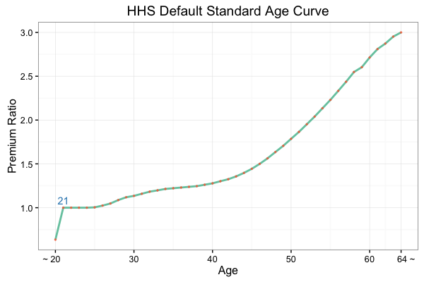


## Rates: Age and Plan Length

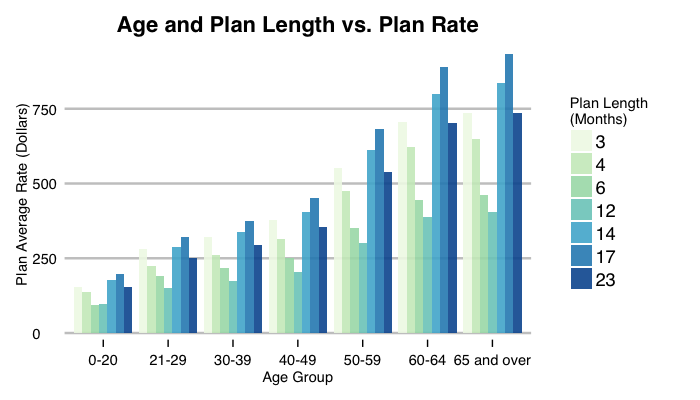


## Rates: Age and Plan Length

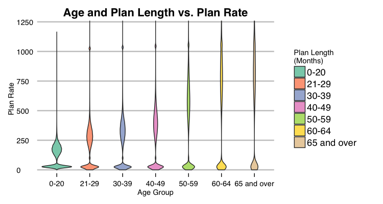


## Rates: Age and Tobacco Policy

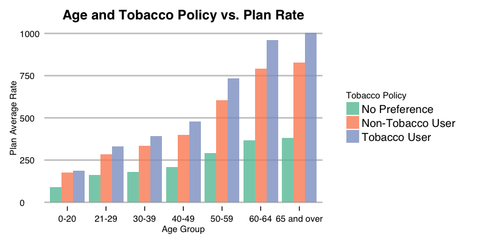
<br>
Future question: lower rates and benefits?


## Rates: Family Options and States

```{r, results='asis'}
plot(gvisGeoChart(AvgGroup, 'StateCode', 'Avg', 
                        options = list(region = "US", 
                                       displayMode = "regions", 
                                       resolution = "provinces",
                                       colorAxis = "{colors: ['#e0f3db', '#a8ddb5', '#43a2ca']}",
                                       datalessRegionColor = '#ffffff')), "chart")
```
<br>
Future question: why?

## Benefits: Plan Type
- HMO: Health Maintenance Organizations, inside network, need referral to see a specialist
- PPO: Preferred Provider Organizations, both inside and outside
- EPO: Exclusive Provider Organizations, inside network, no need for referral
- POS: Point of Service, both inside and outside, need referral
- INDEMNITY: almost any doctor or hospital you like, higher charges

## Benefits: Plan Type

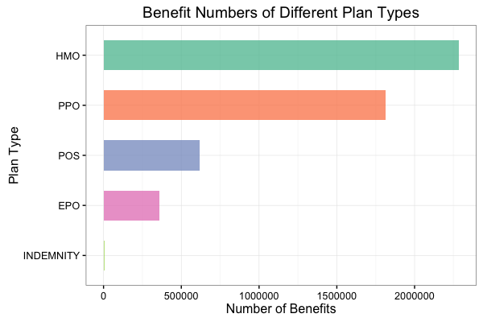


## Not Covered/Covered Ratio vs. Plan Type

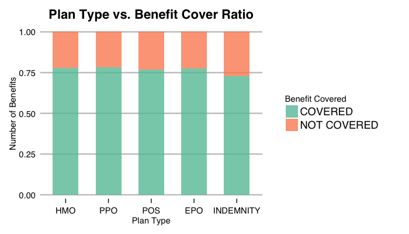


## Benefit Variety vs. Plan Type

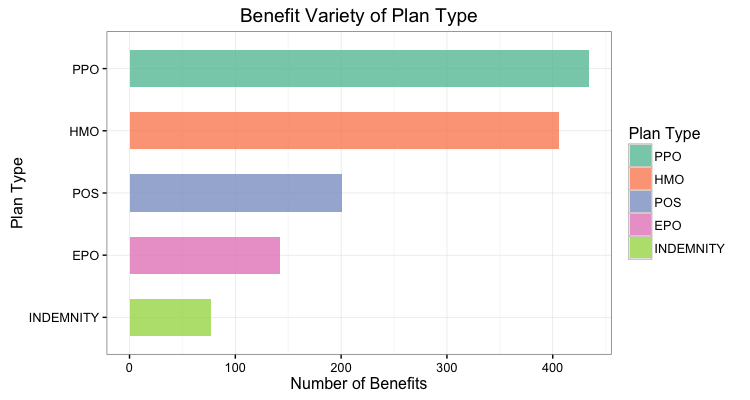


## Which Plan Type? - HMO

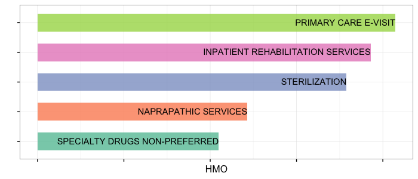


## Which Plan Type? - PPO

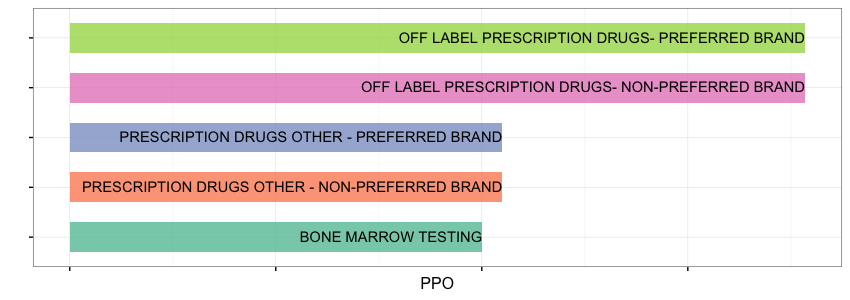


## Which Plan Type? - POS

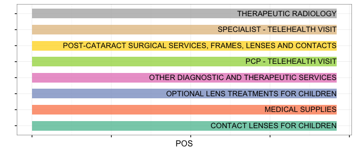


## Which Plan Type? - EPO

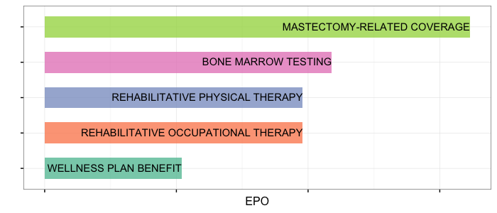


## Which Plan Type? - INDEMNITY

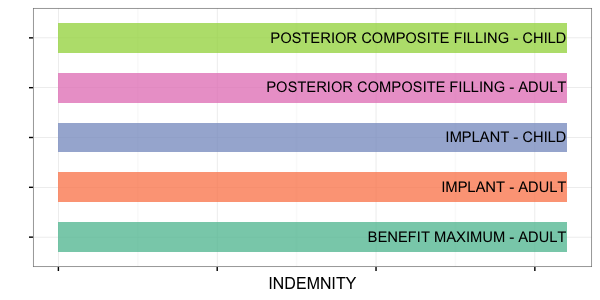

## Inference and Future Question

- Rates: age, plan length, tobacco policy, family options, states
<br><br>
- Benefits: plan type, unique benefits
<br><br>
- Future questions: 
    - why non-preference tobacco policy with lower rates?
    - why region matters?
    - what is the relationship between benefits and rates?
    - for different medical expensenes, which is the optimal plan?


# Thank you!