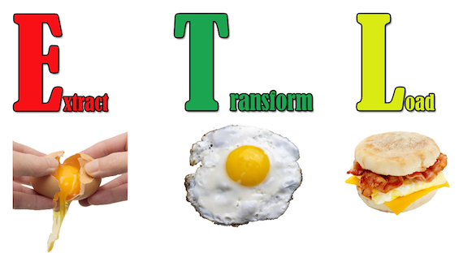

```{r setup, include=FALSE, message=FALSE, warning=FALSE}
knitr::opts_chunk$set(echo = FALSE)
library(dplyr)
library(ggplot2)
library(ggthemes)
library(knitr)
```

```{r, echo=FALSE}
logo <- "assets/img/i.told.you.so.jpg"
```

## Most asian parents tell their children :
####  Higher Education + 
####  Work Hard +
####  Happy Marriage =
####    **Good Life** 
### ?
### ? Myth or Fact ?
### ?

----

### I know, I know, a **Good Life** is **NOT** identical to ...  
### But, be honest, you know and I know, we need some  to have a **Good Life**.  
### Using **R** and **ggplot2**, and visually exploring the *Adult* dataset from *UC Irvine Machine Learning Repository*, I may become the Myth Buster of :
###  +  +  =      

----

```{r, engine='bash', echo=FALSE, eval=TRUE, results='hide'}
# Get adult.data from repository.
curl -O "http://archive.ics.uci.edu/ml/machine-learning-databases/adult/adult.data" 
# Move adult.data to folder data.
mv adult.data data/
# adult.data uses ", " (comma followed by one space) as field separator.
# Transform field separator to "," (a single comma).
sed -i -e 's/, /,/g' data/adult.data
# adult.data uses "?" for missing values.
# Transform missing values with "NA".
sed -i -e 's/?/NA/g' data/adult.data
```



---

- The *Adult* dataset is originally used to predict whether income exceeds $50K/year, based on 1994 census data.  Information can be found at [http://archive.ics.uci.edu/ml/datasets/Adult](http://archive.ics.uci.edu/ml/datasets/Adult).

- The *Adult* dataset can be downloaded at [http://archive.ics.uci.edu/ml/machine-learning-databases/adult/adult.datahttp://archive.ics.uci.edu/ml/machine-learning-databases/adult/adult.data](http://archive.ics.uci.edu/ml/machine-learning-databases/adult/adult.data).

- The *Adult* dataset uses ", " (comma followed by one space) as field separator. I transform it to "," (a single comma).

- The *Adult* dataset uses "?" for missing values. I transform it with "NA".

---

```{r}
adult = read.table('data/adult.data', header=FALSE, sep=',', na.strings=(NA))
```
- I load the *Adult* dataset to data frame *adult* which has `r ncol(adult)` attributes and `r nrow(adult)` observations.
```{r, echo=TRUE}
dim(adult)
```
```{r}
adult = na.omit(adult)
```
- I remove NA rows and then it has `r ncol(adult)` attributes and `r nrow(adult)` observations.
```{r, echo=TRUE}
dim(adult)
```

---

- I give each attribute a name:
```{r, echo=TRUE}
colnames(adult) = c(
'age', 'workclass', 'fnlwgt', 'education', 'education_num',
'marital_status', 'occupation', 'relationship', 'race', 'sex',
'capital_gain', 'capital_loss', 'hours_per_week', 
'native_country', 'class')
colnames(adult)
```

---

- I rename *Marital Status* for better display and counting:
```{r, echo=TRUE}
levels(adult$marital_status)[levels(adult$marital_status)
   =="Divorced"] = "Divor"
levels(adult$marital_status)[levels(adult$marital_status)
   =="Married-AF-spouse"] = "Marri"
levels(adult$marital_status)[levels(adult$marital_status)
   =="Married-civ-spouse"] = "Marri"
levels(adult$marital_status)[levels(adult$marital_status)
   =="Married-spouse-absent"] = "Marri"
levels(adult$marital_status)[levels(adult$marital_status)
   =="Never-married"] = "Never"
levels(adult$marital_status)[levels(adult$marital_status)
   =="Separated"] = "Separ"
levels(adult$marital_status)[levels(adult$marital_status)
   =="Widowed"] = "Widow"
levels(adult$marital_status)
```

---

- I rename *Work Class* for better display and counting:
```{r, echo=TRUE}
levels(adult$workclass)[levels(adult$workclass)=="Federal-gov"] ="GOV"
levels(adult$workclass)[levels(adult$workclass)=="Local-gov"] = "GOV"
levels(adult$workclass)[levels(adult$workclass)=="Never-worked"] = 
  "NEVER"
levels(adult$workclass)[levels(adult$workclass)=="Private"] = "PRIV"
levels(adult$workclass)[levels(adult$workclass)=="Self-emp-inc"] = 
  "SELF"
levels(adult$workclass)[levels(adult$workclass)=="Self-emp-not-inc"] = 
  "SELF"
levels(adult$workclass)[levels(adult$workclass)=="State-gov"] = "GOV"
levels(adult$workclass)[levels(adult$workclass)=="Without-pay"] = 
  "NOPAY"
levels(adult$workclass)
```
---

- I add numeric "Ed Level" based on factor "Education":
```{r, echo=FALSE, message=FALSE, warning=FALSE}
adult = mutate(adult, ed_level = 0)
obs = nrow(adult)
for (i in 1:obs) {
	switch(adult$education[i],
      "Preschool" = { adult$ed_level[i] = 1 },
      "1st-4th" = { adult$ed_level[i] = 2 },
      "5th-6th" = { adult$ed_level[i] = 3 },
      "7th-8th"= { adult$ed_level[i] = 3 },
      "9th" = { adult$ed_level[i] = 4 },
      "10th" = { adult$ed_level[i] = 4 },
      "11th" = { adult$ed_level[i] = 4 },
      "12th" = { adult$ed_level[i] = 4 },
      "HS-grad"  = { adult$ed_level[i] = 4 },
      "Some-college" = { adult$ed_level[i] = 4 },
      "Assoc-acdm"  = { adult$ed_level[i] = 5 },
      "Assoc-voc" = { adult$ed_level[i] = 5 },
      "Prof-school" = { adult$ed_level[i] = 5 },
      "Bachelors"  = { adult$ed_level[i] = 6 },
      "Masters" = { adult$ed_level[i] = 7 },
      "Doctorate" = { adult$ed_level[i] = 8 })}
```

```{r, echo=TRUE, eval=FALSE}
adult = mutate(adult, ed_level = 0)
obs = nrow(adult)
for (i in 1:obs) {
	switch(adult$education[i],
      "Preschool" = { adult$ed_level[i] = 1 },
      "1st-4th" = { adult$ed_level[i] = 2 },
      "5th-6th" = { adult$ed_level[i] = 3 },
      "7th-8th"= { adult$ed_level[i] = 3 },
      "9th" = { adult$ed_level[i] = 4 },
      "10th" = { adult$ed_level[i] = 4 },
      "11th" = { adult$ed_level[i] = 4 },
      "12th" = { adult$ed_level[i] = 4 },
      "HS-grad"  = { adult$ed_level[i] = 4 },
```

---

```{r, echo=TRUE, eval=FALSE}
      "Some-college" = { adult$ed_level[i] = 4 },
      "Assoc-acdm"  = { adult$ed_level[i] = 5 },
      "Assoc-voc" = { adult$ed_level[i] = 5 },
      "Prof-school" = { adult$ed_level[i] = 5 },
      "Bachelors"  = { adult$ed_level[i] = 6 },
      "Masters" = { adult$ed_level[i] = 7 },
      "Doctorate" = { adult$ed_level[i] = 8 })}
```

---

- I use numeric *Education Years* from original dataset as education indicator since it agrees with factor *Education*.

```{r}
ggplot(adult, aes(x=ed_level, y=education_num)) + 
  geom_smooth(method = "lm")  + 
  labs(x="Education Level", y="Education Years", 
       title="More/Longer Education Years indicates Higher Education") +
  theme_economist() + scale_fill_economist() 
```

---

- I single asian out from *adult* into data frame *asian_adult*:

```{r, echo=TRUE}
levels(adult$race)
summarise( group_by(adult, race), n())
asian_adult = adult[adult$race == "Asian-Pac-Islander",]
```

---

- I further single out asian adult working in private section since this sector has more asian adult.

```{r}
ggplot(asian_adult, aes(x=workclass)) + 
  geom_bar(aes(fill=class)) + facet_wrap(~sex) + 
  xlab("work class [ Government | Private | Self-employed | No-pay ]") +
  theme_economist() + scale_fill_economist() +
  ggtitle("Asian Adult - Which work class pay ?")
```

---

 +  +  =    ???

```{r}
ggplot(asian_adult[asian_adult$workclass=="PRIV",], aes(x=education_num,y=hours_per_week)) + 
  geom_point() + facet_grid(marital_status ~ class) +
  labs(x = "# education years", y = "work hours / week",
  title="Asian Adult - higher education + hard work + happy marriage = $$$ ?")  +
  theme_economist() + scale_fill_economist() 
```

---

 -Dad & Mom: You are right. 
```{r}
ggplot(asian_adult[asian_adult$workclass=="PRIV",], aes(x=class, y=education_num)) + 
  geom_boxplot() + facet_wrap(~sex) +
  labs(x = "", y = "# education years", 
  title = "Asian adult in private sector - Yes, higher education helps!") +
  theme_economist() + scale_fill_economist() 
```

---

 -Dad & Mom: You are right about boys. 
```{r}
ggplot(asian_adult[asian_adult$workclass=="PRIV",], aes(x=class, y=hours_per_week)) + 
  geom_boxplot() + facet_wrap(~sex) +
  labs(x = "", y = "work hours / week",
  title = "Asian adult in private sector - Well, men, you better work longer :( ") +
  theme_economist() + scale_fill_economist()
```

---

 -Dad & Mom: You are right again!
```{r}
ggplot(asian_adult[asian_adult$workclass=="PRIV",], aes(x=marital_status)) + 
  geom_bar(aes(fill=marital_status)) + facet_grid(class ~ sex) +
  xlab("marital status") + 
  theme_economist() + scale_fill_economist() +
  ggtitle("Asian adult in private sector - Hey, married people do earn more.")
```

## A few thoughts

Two out of three ain't bad, right?  But, I won't conclude the formula is a fact, as I think the asian adult sample in 1994 *Adult* dataset (895) seems too small.  A conclusion should be drawn after explored more samples from multiple years.

As an asian myself, I listen and obey my parents as they always want the best for me.  Most things change as time evolves; thus, it is reasonable to say very few things hold true forever.  But, parents' care for their children never change.  

You may ask, "Are you sure?"  **"Yes, because I told you so!!!"**

Sincerely, Conred Wang.
