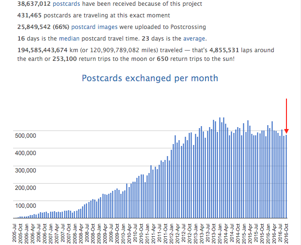
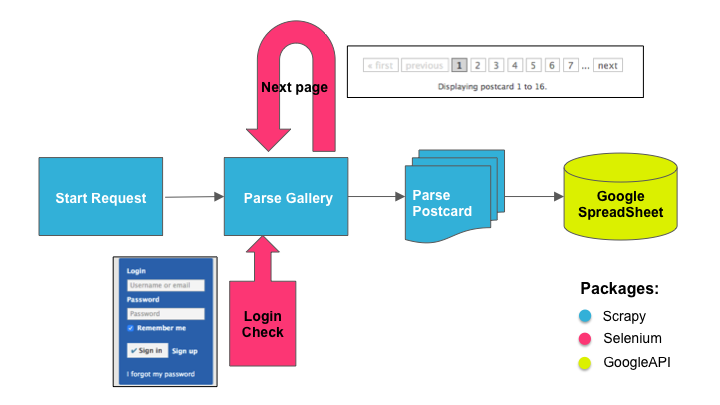
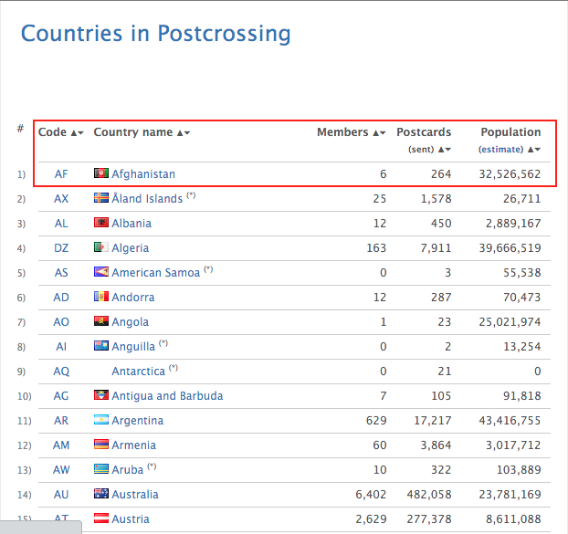
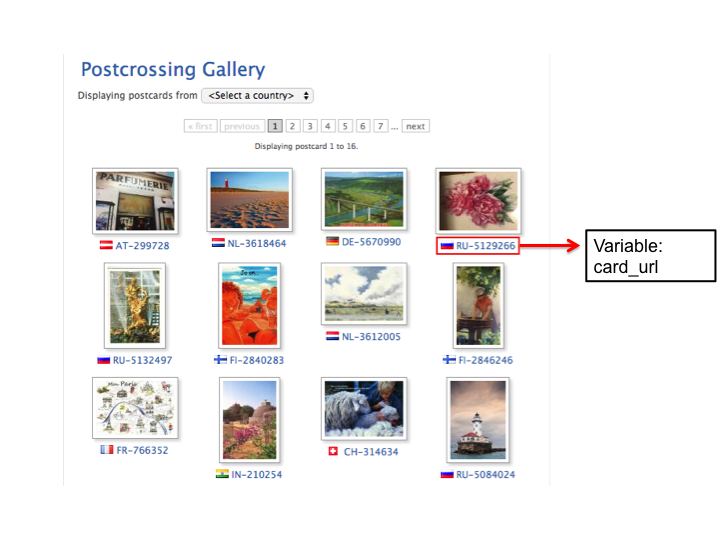
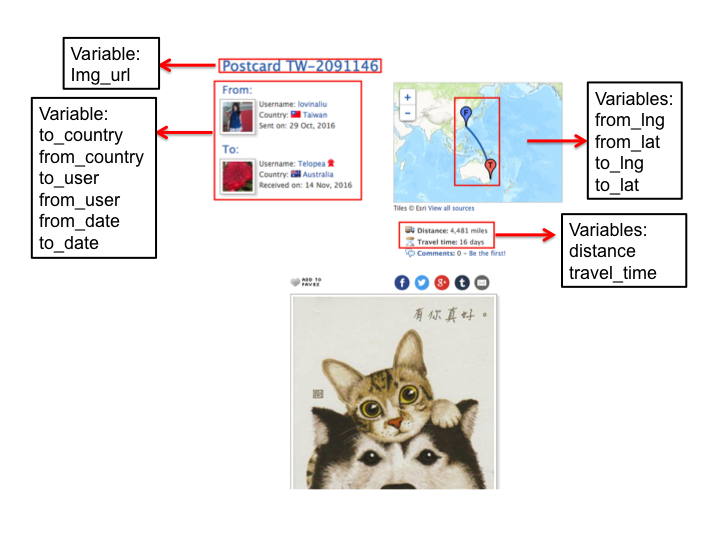

```{r setup, include=FALSE, warning=FALSE, message=FALSE, cache=TRUE}
knitr::opts_chunk$set(echo = FALSE, 
                      warning=FALSE, 
                      message=FALSE, 
                      cache=TRUE)
library(ggplot2)
library(plotly)
library(leaflet)
library(maps)
library(rgeos)
library(maptools)
library(ggmap)
library(geosphere)
# library(plyr)
library(dplyr)

setwd("~/Desktop/HappyPostcrossing/WebScrapingProject/")
postcard <- readRDS("./postcard.rds")
country <- readRDS("./country.rds")
```

## Postcrossing.com

Birthday: July 14th, 2005 

Goal: to connect people across the world through postcards, independent of their location, age, gender, race or beliefs


## Postcrossers

651,405 registered members in 210 different countries

The most active postcrosser: 


## Postcards


## Motivations

1. Distribution of postcrossers and postcards all over the world

2. Postcards exchanged one day 

## Data Collection 



## Scraping#1: Distributions of Postcrossers & Postcards 



## Scrapying#2: Postcards Exchanged/Day



## Scrapying#2: Postcards Exchanged/Day 



## Analysis: Postcards by Country

```{r echo=FALSE, warning=FALSE, message=FALSE}
# detach(package:plyr)
suppressMessages(library(dplyr))
suppressMessages(library(ggplot2))
# barchart: postcards by country
PostcardCount <- country %>% 
  top_n(10, postcards) %>%
  mutate(postcards = postcards / 1e6)
PostcardCount$country <-factor(PostcardCount$country, 
                               levels=PostcardCount$country[order(PostcardCount$postcards)])
  ggplot(PostcardCount, 
       aes(country, postcards)) +
  geom_bar(fill= rep(c("#3279BA", "#DA2349"),5), stat="identity", colour="white") +
  coord_flip() +
  xlab("Country (Top10)") + ylab("Nnumber of Postcards(sent), Million ") +
  ggtitle("Postcards(sent) by Country (2005-2016)") + 
  theme_bw()
```

## Postcrossers by Country

```{r echo=FALSE, warning=FALSE, message=FALSE}
 MemberCount <- country %>% 
  top_n(10, members)
MemberCount$country <-factor(MemberCount$country, 
                               levels=MemberCount$country[order(MemberCount$members)])
  ggplot(MemberCount, 
         aes(country, members)) +
    geom_bar(fill= rep(c("#3279BA", "#DA2349"),5), stat="identity", colour="white") +
    coord_flip() +
    xlab("Country (Top10)") + ylab("Number of Postcrossers") +
    ggtitle("Postcrossers by Country (2005-2016)") + 
    theme_bw()
```
 
## Density by Country
```{r echo=FALSE, warning=FALSE, message=FALSE}
country <- country %>% 
  mutate(density=1000 * members/population)

Density <- country %>% top_n(10, density)

Density$country <-factor(Density$country, 
                         levels=Density$country[order(Density$density)])

  ggplot(Density, aes(country, density)) + 
    geom_bar(fill= rep(c("#3279BA", "#DA2349"),5), stat="identity", colour="white") +
    coord_flip() +
    xlab("Country (Top10)") + ylab("#Postcrossers in Every 1000 People") +
    ggtitle("Density of Postcrossers by Country (2005-2016)") + 
    theme_bw()
```

## #Postcards/Postcrosser by Country
```{r echo=FALSE, warning=FALSE, message=FALSE}
country <- country %>% 
  mutate(pcpermem = postcards/members)

Permem <- country %>% 
  filter(members > 1000) %>% 
  top_n(10, pcpermem)

Permem$country <-factor(Permem$country, 
                        levels=Permem$country[order(Permem$pcpermem)])

ggplot(Permem, aes(country, pcpermem)) +
    geom_bar(fill= rep(c("#3279BA", "#DA2349"),5), stat="identity", colour="white") +
    coord_flip() +
    xlab("Country (Top10)") + ylab("#Postcards (sent) Per Postcrosser") +
    ggtitle("#Postcards(sent) per Postcrosser by Country (2005-2016)") +
    theme_bw()
```

## Postcrossers vs. Postcards(sent)
```{r echo=FALSE, warning=FALSE, message=FALSE}
print(paste("Correlation: ", cor(log(country$postcards + 1), log(country$members + 1))))
ggplot(country, aes(x=log(members+1), y=log(postcards+1))) + geom_point() +
  xlab("log(#Postcrosser)") + ylab("log(#Postcard)") +
    ggtitle("Scatter Plot of Postcrossers and Postcards (2005-2016)")
```

##

```{r echo=FALSE, cache=FALSE, warning=FALSE, message=FALSE}
library(leaflet)
from_icon <- leaflet::icons(
  iconUrl = "https://static1.postcrossing.com/favicon.ico",
  iconWidth = 32, iconHeight = 32)

to_icon <- leaflet::icons(
  iconUrl = "https://cdn4.iconfinder.com/data/icons/social-media-pro-icons/1080/Fancy-01-128.png",
  iconWidth = 32, iconHeight = 32)

domain = "https://www.postcrossing.com"

post_popup <- paste0("<a href='", 
                     postcard$card_url,
                     "'></a><br><a href='",
                     domain, "/user/",
                     postcard$from_user,
                     "'>", postcard$from_user,"</a>",
                     " sent on ", postcard$from_date,
                     "<br><a href='",
                     domain, "/user/",
                     postcard$to_user,
                     "'>", postcard$to_user,"</a>",
                     " received on ", postcard$to_date)

leaflet_crossing <- leaflet::leaflet(postcard) %>%
  addTiles() %>%
  addProviderTiles("Thunderforest.Transport") %>%
  addMarkers(~from_lng, ~from_lat, 
             clusterOptions = markerClusterOptions(),
             icon = from_icon, popup = post_popup,
             group = "From") %>%
  addMarkers(~to_lng, ~to_lat, 
             clusterOptions = markerClusterOptions(),
             icon = to_icon, popup = post_popup,
             group = "To") %>%
  addLayersControl(overlayGroup = c("From", "To"),
                   options = layersControlOptions(collapsed = FALSE))

leaflet_crossing
```

## Mapping Postcards Routes

```{r echo=FALSE, warning=FALSE, message=FALSE}
routes_all <- postcard %>% select(from_lat, from_lng, to_lat, to_lng)

fortify.SpatialLinesDataFrame = function(model, data, ...){
  ldply(model@lines, fortify)
}
suppressMessages(suppressWarnings(library(geosphere)))
suppressMessages(suppressWarnings(library(maptools)))
suppressMessages(suppressWarnings(library(plyr)))

routes = gcIntermediate(routes_all[,c('from_lng', 'from_lat')], 
                        routes_all[,c('to_lng', 'to_lat')], 
                        200, breakAtDateLine = FALSE, addStartEnd = TRUE, sp=TRUE)

fortifiedroutes = fortify.SpatialLinesDataFrame(routes) 


#### creat the backgroud urbanworld map

urbanareasin <- readShapePoly("./ne_10m_urban_areas/ne_10m_urban_areas.shp")
worldmap <- map_data ("world")

wrld<-c(geom_polygon(aes(long,lat,group=group), 
                     size = 0.1, colour= "#090D2A", fill="#090D2A", 
                     alpha=0.8, data=worldmap))

urb <- c(geom_polygon(aes(long, lat, group = group),
                      size = 0.3,
                      color = "#ffffff",
                      fill = "#ffffff",
                      alpha = 1,
                      data = urbanareasin))

ggplot() + wrld + urb +
  geom_line(aes(long, lat, group=id, colour="#DA2349"), 
            alpha = 0.05, size=0.5, data=fortifiedroutes) + 
  theme(panel.background = element_rect(fill='#00001C',colour='#00001C'), 
        panel.grid.major = element_blank(), panel.grid.minor = element_blank(),
        legend.position="none") + 
  guides(fill = guide_legend(keywidth = 20, keyheight = 20))

```

## Distance vs. Travel Time Scatterplot

```{r echo=FALSE, warning=FALSE, message=FALSE}
print(paste("Correlation:", cor(log(postcard$distance+1), log(postcard$travel_time+1))))
```

```{r echo=FALSE, warning=FALSE, message=FALSE}
ggplot(postcard, aes(log(distance+1), log(travel_time+1))) + 
  geom_point(color = ifelse(postcard$from_country == postcard$to_country,
                            "#3279BA", "#DA2349"),
             alpha = ifelse(postcard$from_country == postcard$to_country,
                            .5, .1)) +
  xlab("log(Travel Distance)") + ylab("log(Travel Time)") +
  ggtitle("Postcards Travel Distance vs. Travel Time") +
  theme_bw()
```


