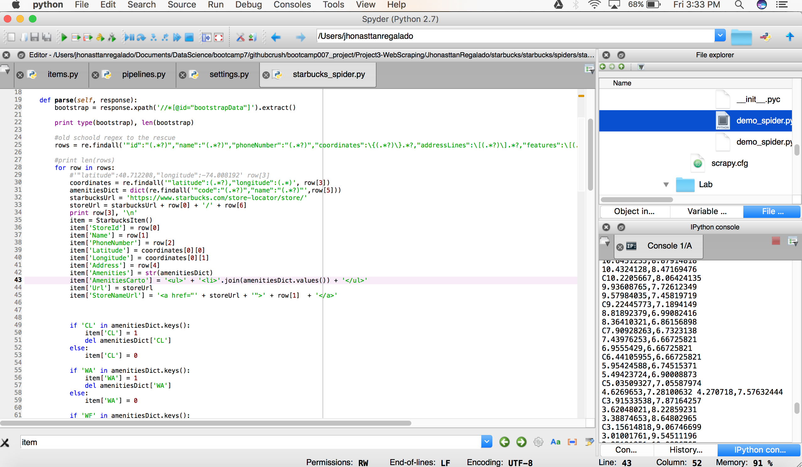

```{r, echo=FALSE, warning=FALSE, error=FALSE, message=FALSE}
#Load data rendered by Scrapy
library(purrr)
library(ggplot2)
library(plotly)
library(psych)
library(DT)
library(reshape2)
require(FactoMineR)


df_sb <- read.csv('./starbucks/StarbucksStores.txt', stringsAsFactors = FALSE)
df_sb_unique <- df_sb[!duplicated(df_sb), ]

#PCA procedure to determine which amenities should be enabled for filtering on the map
df_sb_pca <- df_sb_unique[,c(11:ncol(df_sb_unique))] #select the amenities columns
df_sb_pca <- df_sb_pca[,-ncol(df_sb_pca)] #drop the last column 'AmeOther'

#head(df_sb_unique[,1:7], 1)

```

## Problem: Multiple clicks are required to list Starbucks Coffee store amenities 

### [Starbucks Store Locator page](https://www.starbucks.com/store-locator?map=39.635307,-101.337891,5z)

## Goal: Visualize the Starbucks Coffee Store locations and their amenities

### Scope: 

* Scrapy for web scraping stores and their amenities via Starbucks Coffee Store Locator website
* R for numerical / visual EDA
* CARTO for visual EDA
* MCA (Multiple Correspondence Analysis) for analyzing commonalities between the amenities
* Map layer for Shiny Citibike Analysis app


### [Visual EDA TIME!!!](https://jhonasttan.carto.com/viz/69f64b70-a6c8-11e6-8d32-0e233c30368f/public_map)

### The Process: 

#### Scrapy the magic sauce:


#### Processed data provides store geospatial information and associated amenities

* Regex (regular expressions) for feature engineering amenities data - used as filter criteria in CARTO map layers
* HTML wrapper for store location - CARTO renders fields in HTML format out of the box
* Duplicate rows!! Not an issue for CARTO which treats geospatial locations as unique

 


#### View of the CARTO ready data after processing in Scrapy and R is complete:
    
```{r, echo=FALSE, warning=FALSE, error=FALSE}

#df_sb_pca %>% count() #number of stores

#amenMean <- map_dbl(df_sb_pca,sd)
#amenMean <- sort(amenMean,decreasing = TRUE)
#amenMean <- as.data.frame(amenMean, row.names = rownames(amenMean))
#amenMean

#amenSd <- map_dbl(df_sb_pca,sd)
#amenSd <- sort(amenSd,decreasing = TRUE)
#amenSd <- as.data.frame(amenSd, row.names = rownames(amenSd))
#amenSd

amenSums <- map_dbl(df_sb_pca, sum)
amenSums <- sort(amenSums,decreasing = TRUE)
amenSums <- as.data.frame(amenSums, row.names = rownames(amenSums))
#amenSums

#amenStatsCombined <- cbind(amenSums,amenMean)
#amenStatsCombined <- cbind(amenStatsCombined, amenSd)
#menStatsCombined

#Data table
datatable(df_sb_unique, options = list(
  searching = TRUE,
  pageLength = 5,
  lengthMenu = c(5, 10, 15, 20)
))
```


#### List of Amenities:

```{r, echo=FALSE, warning=FALSE, error=FALSE}

df_sb_subset <- df_sb_unique[,c(2:32)]
df_sb_subset <- df_sb_subset[,-c(2:9)]
mdata <- melt(df_sb_subset, id=c("Name"))
#ggplot(mdata,aes(value)) + geom_histogram(aes(fill=variable))
amenSums$amenities <- rownames(amenSums)
#ggplot(amenSums,aes(amenSums)) + geom_bar(aes(fill=amenities)) + coord_flip()
#ggplot(amenSums,aes(amenSums)) + geom_histogram(aes(fill=amenities))

p1 <- ggplot(amenSums,aes(reorder(amenities,amenSums),amenSums)) + #, label = amenSums$amenSums
#amenSum.reordered <- amenSums[reorder(amenSums$amenities,amenSums$amenSums),]
#p1 <- ggplot(amenSum.reordered,aes(amenities,amenSums)) + #, label = amenSums$amenSums
  geom_bar(stat = "identity", aes(fill=amenities)) + 
  ylab("Count") + 
  xlab("Amenities by Code") +
  ggtitle("Starbucks Coffee Store Amenities") +
  theme(legend.position="none") +
  coord_flip()
ggplotly(p1)

# * LB: LaBoulange
# * WA: Oven-warmed Food
# * LU: Lunch
# * CL: Starbucks Reserve-Clover Brewed
# * WF: Wireless Hotspot
# * CD: Mobile Payment
# * DR: Digital Rewards
# * GO: Google Wi-Fi
# * FZ: Fizzio Handcrafted Sodas
# * XO: Mobile Order and Pay,
# * RW: My Starbucks Rewards,
# * PS: Playbook Store System
# * CS: tbd - Coffee Scale
# * MX: Music Experience
# * VS: Verismo
# * NB: Nitro Cold Brew
# * SQ: tbd
# * EM: Starbucks Evenings
# * BA: Bakery
# * WT: tbd - Walk-T
# * hrs24: Open 24 hours per day
# * DT: Drive-Through

```

#### Five most common amenities:

* LB: LaBoulange
* WA: Oven-warmed Food
* LU: Lunch
* DR: Digital Rewards
* XO: Mobile Order and Pay

#### Five least common amenities:

* DT: Drive-Through
* EM: Starbucks Evenings
* WT: tbd - Walk-T
* FZ: Fizzio Handcrafted Sodas
* hrs24: Open 24 hours per day

### MCA (Multiple Correspondence Analysis)

#### As with PCA and Correspondence Analysis, MCA allows us to analyze the systematic patterns of variations with categorical data. 

```{r, echo=FALSE, warning=FALSE, error=FALSE}
# convert the amenities features to factor variables
df_sb_pca[] <- lapply( df_sb_pca, factor )

# apply MCA
mcaAme = MCA(df_sb_pca, graph = FALSE)
# list of results
```

#### List the eigen values

```{r, echo=FALSE, warning=FALSE, error=FALSE}
mcaAme$eig
```

#### View the relationships

```{r, echo=FALSE, warning=FALSE, error=FALSE}
# data frame with variable coordinates
ameCats = apply(df_sb_pca, 2, function(x) nlevels(as.factor(x)))
mca1_vars_df = data.frame(mcaAme$var$coord, Variable = rep(names(ameCats), ameCats))

# data frame with observation coordinates
mca1_obs_df = data.frame(mcaAme$ind$coord)

# plot of variable categories
#ggplot(data=mca1_vars_df, 
#       aes(x = Dim.1, y = Dim.2, label = rownames(mca1_vars_df))) +
# geom_hline(yintercept = 0, colour = "gray70") +
# geom_vline(xintercept = 0, colour = "gray70") +
#geom_text(aes(colour=Variable)) +
# ggtitle("MCA plot of variables using R package FactoMineR")


# MCA plot of observations and categories
ggplot(data = mca1_obs_df, aes(x = Dim.1, y = Dim.2)) +
  geom_hline(yintercept = 0, colour = "gray70") +
  geom_vline(xintercept = 0, colour = "gray70") +
  geom_point(colour = "gray50", alpha = 0.7) +
  geom_density2d(colour = "gray80") +
  geom_text(data = mca1_vars_df, 
            aes(x = Dim.1, y = Dim.2, 
                label = rownames(mca1_vars_df), colour = Variable)) +
  ggtitle("MCA plot of Amenities") +
  scale_colour_discrete(name = "Variable") + theme_bw()
```

#### Five most common amenities:

* LB: LaBoulange
* WA: Oven-warmed Food
* LU: Lunch
* DR: Digital Rewards
* XO: Mobile Order and Pay

##### MCA results shows amenities CD (Mobile Payment) and MX (Music Experience) within the cluster having the five most common amenities.

#### Five least common amenities:

* DT: Drive-Through
* EM: Starbucks Evenings
* WT: tbd - Walk-T
* FZ: Fizzio Handcrafted Sodas
* hrs24: Open 24 hours per day

### Follow ups:

  1. Highlight the Most / Least common amenities when the user hovers over a store location in CARTO
  2. Create a Map Layer for Shiny Citibike Analysis app, allowing users to locate Starbucks Coffee stores based on amenities and proximity
  
[LinkedIn: Jhonasttan Regalado](https://www.linkedin.com/in/jhonasttanregalado)
  

  
  