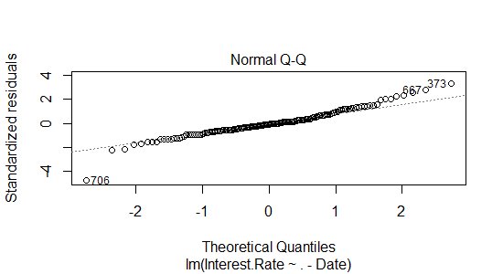
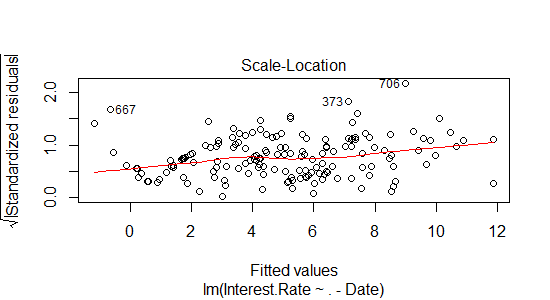

<style type="text/css">

body{ /* Normal  */
   font-size: 12px;
}
td {  /* Table  */
   font-size: 8px;
}
h1 { /* Header 1 */
 font-size: 28px;
 color: DarkBlue;
}
h2 { /* Header 2 */
 font-size: 26px;
 color: DarkBlue;
}
h3 { /* Header 3 */
 font-size: 18px;
 color: DarkBlue;
}
code.r{ /* Code block */
  font-size: 12px;
}
pre { /* Code block */
  font-size: 12px
}
</style>
```{r setup, include=FALSE}
knitr::opts_chunk$set(echo = FALSE)
library(VIM)
library(mice)
library(dplyr)
library(car)
library(ggplot2)
library(ggthemes)
library(reshape2)
library(nnet)
library(tree)
library(randomForest)
```

## Motivation

- Federal Open Market Committee (FOMC) alway make the desicion beyond the market expectation, which cause huge global capital market volatility

- Find out the impact factor that influence FOMC dicision

- Set up one model to avoid the risk of market volatility

- Generte profit during the market volatility 

## Perspective

- Lineaer Regression (numeric)  -Find out the equation to predict the precise interest rate

- Classfication  (Multinomial)  -Find out the possibility of interest rate change

```{r, echo = FALSE}
Ist<-read.csv("Ist_mannul.csv")

```

## Data Collection ----Web Scrapy

- Used Scrapy and Selenium, and Collected 100 csv files from "https://fred.stlouisfed.org"

- 100 variables of US economic, potentially 'r 2^100' possible models

## Linear Regression Model
$Interest.Rate =$ $13.09 + 1.1*BankLoan$ $+ 0.39RealExport$ $+ 0.148*US.Dollar.Index$ $+ 0.93*Personal.Consumption.Expenditures$ $- 1.03*UnEm.rate$ $- 0.13631*RGDP$ $- 1.08996*Total.Vehicle.Sales$
```{r, echo = FALSE}
#Ist<-read.csv("Ist_mannul.csv")
Ist$Date<-as.Date(Ist$Date)
Ist.select<-Ist[,-c(1,4)]
Ist.select<-select(Ist.select,-Brent.Oil,-Taxas.Oil)
Ist.select<-select(Ist.select,-Home.Price.Index,-US_Euro,-SP500,-Home.Price.Index,-Manufacturing.output,-NASDAQ)
Ist.select_2<-select(Ist.select,-ten.yr.T.Rate,-one.yr.Treasury.Rate,-Bond.Yield,-T.bill.MRate)
Ist.select_3<-select(Ist.select_2,-Unemployment.Level,-Em_Pop.rate,-Light.vehicle.sale,-Employee.payroll,-LFP.rate,-NewHouse.permit,-Inflation)
Ist.select_4<-select(Ist.select_3,-GDP_CHN,-Stock.Capitalization.to.GDP,-M2.velocity,-Industrial.Index,-ConsumerPrice,-NetExport,-Debt.rates)
Ist.select_final<-select(Ist.select_4,-PrivateInvest,-Disposable.income,-Psaving.rate,-New.House.Start,-M1.velocity)
Ist.complete_final<-Ist.select_final[complete.cases(Ist.select_final),]
model.season_final<-lm(Interest.Rate~ .-Date, data = Ist.complete_final)


#Ist.select<-select(Ist,-LIBOR.Lodon,-Home.Price.Index,-US_Euro,-SP500,-Home.Price.Index,-Manufacturing.output,-NASDAQ,-Brent.Oil,-Taxas.Oil)
#Ist.select_2<-select(Ist.select,-ten.yr.T.Rate,-one.yr.Treasury.Rate,-Bond.Yield,-T.bill.MRate)
#Ist.select_3<-select(Ist.select_2,-Unemployment.Level,-Em_Pop.rate,-Light.vehicle.sale,-Employee.payroll,-LFP.rate,-NewHouse.permit,-Inflation)
#Ist.select_4<-select(Ist.select_3,-GDP_CHN,-Stock.Capitalization.to.GDP,-M2.velocity,-Industrial.Index,-ConsumerPrice,-NetExport,-Debt.rates)
#Ist.select_final<-select(Ist.select_4,-PrivateInvest,-Disposable.income,-Psaving.rate,-New.House.Start,-M1.velocity)
#Ist.complete_final<-Ist.select_final[complete.cases(Ist.select_final),]
#model.season_final<-lm(Interest.Rate~ .-Date, data = Ist.complete_final)
```

---
```{r, echo = FALSE, tidy=TRUE}
summary(model.season_final)
```

## Linear Regression Model---Feature Selection
- Mannully Select :remove the variables increasing as time going on or convert to percentage change
```{r,dev='svg',fig.path='myplot',fig.height=5}
ggplot(Ist,aes(x=Date,y=Employee.payroll))+geom_bar(aes(fill=Employee.payroll),stat = 'identity')+theme_bw()
```


## Feature Selection
- Remove the varibles that caused by Interest rate such as LIBOR.Lodon,ten.yr.T.Rate,one.yr.Treasury.Rate,Bond.Yield, T.bill.MRate

- Remove the variables that with high multicollinearity such as Unemployment.Level,Em_Pop.rate,Light.vehicle.sale, Employee.payroll,LFP.rate,NewHouse.permit,Inflation

- Remove the annually variables and no correlation such as Inflation,GDP_CHN,Stock.Capitalization.to.GDP,M2.velocity, Industrial.Index,ConsumerPrice,NetExport,Debt.rates

- Final filter by AIC: Disposable.income,Psaving.rate, New.House.Start,M1.velocity,PrivateInvest

## Linear model result--VIF

```{r, plot,echo = FALSE}
vif(model.season_final)
```

## Linear model result--avPlots

```{r,dev='svg',fig.path='myplot',fig.height=6}
avPlots(model.season_final)
```

## Linear model result--influencePlot
```{r,dev='svg',fig.path='myplot',fig.height=6}
influencePlot(model.season_final)
```

## Linear model result
```{r,dev='svg',fig.path='myplot',fig.height=6}
plot(model.season_final)
```

---
  
  

## Abnormal sample investigation
###On March 10, 2000 the NASDAQ peaked at 5,132.52 intraday before closing at 5,048.62. Afterwards, the NASDAQ fell as much as 78%
### starting from November 2008, several countries launched large 'help packages' for their economies.
  
```{r echo=FALSE}
x<-Ist[c(622,706),]
ir.pre<-predict(model.season_final,x,type = "response")
data.frame(Date=Ist$Date[c(622,706)],Prediction=ir.pre,Real=Ist$Interest.Rate[c(622.706)])
#table(Ist$Date[c(622,706)],model.season_final$fitted.values[c(104,132)][[1]])
```


## Predict interest rate for 2016 fall
```{r,echo = FALSE,dev='svg',fig.path='myplot',fig.height=3.5}

newdata<-Ist.select_final[793:801,-2]
interest.predict<-predict(model.season_final, newdata)
interest.real<-Ist.select_final[793:801,2]
table(interest.predict,interest.real)
test<-data.frame("Date"=Ist.complete_final$Date,"Interest.Rate.Predict"=model.season_final$fitted.values,"Interest.Rate.Real"=Ist.complete_final$Interest.Rate)
test.melt<-melt(test,id="Date",measure.vars = c("Interest.Rate.Real","Interest.Rate.Predict"))
ggplot(test.melt)+geom_bar(aes(x=Date,y=value,fill=variable),stat = "identity",position = "dodge")+
  theme_economist() + scale_fill_economist()+labs(x="Date",y="Interest Rate",fill="Real v.s Prediction")

```

##Multi-class Classfication---Neural Network

```{r,echo = FALSE,dev='svg',fig.path='myplot',fig.height=4}
generator.2<-function(x){
  y=c()
  for (i in 1:length(x)){
    if (i==length(x)){
      y[i]<-0
      break
    }
    else if (x[i] == x[i+1]){
      y[i]<-0
    }
    else if (x[i] < x[i+1]){
      y[i]=1
    }
    else if (x[i] > x[i+1]){
      y[i]=-1
    }
  }
  return(y)
}
#Ist.complete_4<-Ist.select_4[complete.cases(Ist.select_4),]
Ist.class.2<-mutate(Ist.complete_final,IR=as.factor(generator.2(Interest.Rate)))
Ist.class.2<-Ist.class.2[,-c(1,2)]
names(Ist.class.2)
model.class<-multinom(IR~ .,data = Ist.class.2)
#plot(Ist.class.2)
#summary(model.class)
#model.class$fitted.values
test.class<-data.frame(Ist.class.2[163,1:7])
predict(model.class,test.class,"probs")
```
# Probabilty of no-change is 55.7%, 32.9% for increase 

## Binary Classfication--Tree
```{r,echo=FALSE}
generator<-function(x){
  y=c()
  for (i in 1:length(x)){
    if (i==length(x)){
      y[i]<-0
      break
    }
    else if (x[i] == x[i+1]){
      y[i]<-0
    }
    else {
      y[i]=1
      }
  }
  return(y)
}
Ist.month.class<-Ist[,c(2,3,9,10,11,12,13,20)]
Ist.month.class.bc<-mutate(Ist.month.class,IR=as.factor(generator(Interest.Rate)))[,-c(1,2)]
Ist.month.class.more.va.1<-Ist[110:801,c(2,3,9,10,11,12,13,20,28,29,31)]
Ist.month.class.more.va.1.bc<-mutate(Ist.month.class.more.va.1,IR=as.factor(generator(Interest.Rate)))[,-c(1,2)]
train = sample(1:nrow(Ist.month.class.bc), 7*nrow(Ist.month.class.bc)/10)
sample.test<- Ist.month.class.bc[-train,]
tree.bc<-tree(IR~ ., split = "gini",data = Ist.month.class.bc[train,])
tree.test.pre<-predict(tree.bc,sample.test,type = "class")
table(tree.test.pre,Ist.month.class.bc$IR[-train])
cat('(140+23)/241','=',(140+23)/241)
test.class.month<-data.frame(Ist.month.class.bc[801,1:6])
predict(tree.bc, test.class.month, type = "vector")
```
### Probabilty of no-change is 80%, 20% for increase

## Binary Classfication--Random Tree
```{r,echo=FALSE}

set.seed(200)
train = sample(1:nrow(Ist.month.class.bc), 7*nrow(Ist.month.class.bc)/10)

rf.month.bc = randomForest(IR ~ ., data = Ist.month.class.bc, subset = train, importance = TRUE)
rf.month.bc 

#Varying the number of variables used at each step of the random forest procedure.
#set.seed(200)
#for (mtry in 1:6) {
 # fit = randomForest(IR ~ ., data = Ist.month.class.bc[train, ], mtry = mtry)
#  tr<-table(Ist.month.class.bc$IR[train],fit$predicted)
#  cat("We're performing iteration", mtry, "\n")
#  print(tr)
#}
```

## Multi-class Classfication--Random Tree
```{r,echo=FALSE}
Ist.month.class.mc<-mutate(Ist.month.class,IR=as.factor(generator.2(Interest.Rate)))[,-c(1,2)]
set.seed(200)
train.mc = sample(1:nrow(Ist.month.class.mc), 7*nrow(Ist.month.class.mc)/10)
rf.month.mc = randomForest(IR ~ ., data = Ist.month.class.mc, subset = train.mc, importance=TRUE)
rf.month.mc 
predict(rf.month.mc, test.class.month, type = "prob")
```

## Probabilty of no-change is 98%, 2% for increase
### Future: use Anomaly Detection Algorithm to do the binary classification 