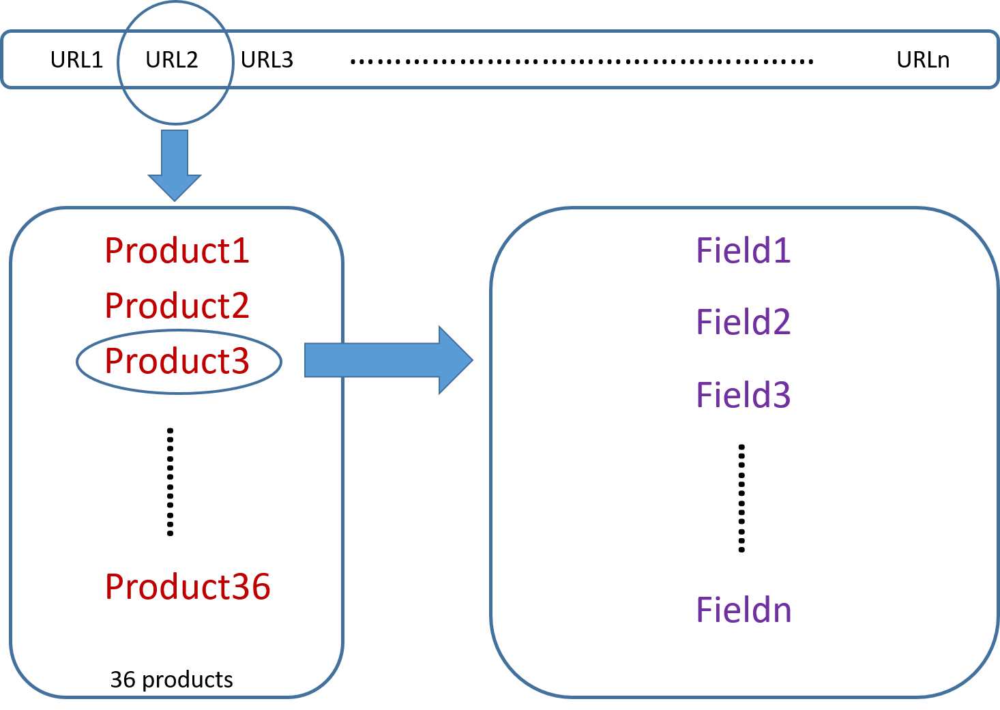

```{r setup, include=FALSE}
knitr::opts_chunk$set(echo = FALSE)
```

## Introduction {.build}

Newegg.com is a vault for many computer fans and PC gamers. Among all computer parts, CPU and Graphic card mainly determine how fast a desktop can run. 
Today, we are going to explore CPUs and graphic cards that are selling on Newegg.com

Data scientists need good desktop!


## Contents

- Web Scraping
- Exploratory Analysis


## [Getting Data Using Scrapy](http://en.wikipedia.org/wiki/YAML) 




## Getting Data Using Scrapy

Data are cleaned using R

```{r echo = FALSE, cache = TRUE, warning = FALSE, message = FALSE}
source('cleaning.R')
```

## Exploratory Analysis

```{r echo = FALSE, cache = TRUE, warning = FALSE, message = FALSE}
cpurating <- cpu %>% select(rating, brand) %>% group_by(rating, brand) %>%
    summarize(count = n()) %>% as.data.frame()
cpurating$rating <- factor(cpurating$rating)
gpurating <- gpu %>% filter(!(chipmake == 'ati')) %>%
    select(rating, chipmake) %>% group_by(rating, chipmake) %>%
    summarize(count = n()) %>% as.data.frame()
gpurating$rating <- factor(gpurating$rating)

g1 <- ggplot(cpurating, aes(x = rating, y = count))
g1 <- g1 + geom_bar(aes(fill = brand), stat = "identity", position = "dodge")
g1 <- g1 + theme_gdocs()
g1 <- g1 + scale_color_manual("Brand", values = c("#FF3300", "#0066FF"))
g1 <- g1 + xlab("Rating") + ylab("Count") + ggtitle("CPU Rating")

g2 <- ggplot(gpurating, aes(x = rating, y = count))
g2 <- g2 + geom_bar(aes(fill = chipmake), stat = "identity", position = "dodge")
g2 <- g2 + theme_gdocs()
g2 <- g2 + scale_color_manual("Brand", values = c("#FF3300", "#0066FF"))
g2 <- g2 + xlab("Rating") + ylab("Count") + ggtitle("GPU Rating")

multiplot(g1, g2, cols = 2)
```

## Exploratory Analysis

```{r echo = FALSE, cache = TRUE, warning = FALSE, message = FALSE}
# 10 gpu, top 150 gpu vs. brands
data10 <- gpu %>% top_n(-200, rank) %>% group_by(chipmake, brand) %>%
    summarize(count = n()) %>% as.data.frame()

g <- ggplot(data10, aes(x = brand, y = count))
g <- g + geom_bar(aes(fill = chipmake), stat = "identity", position = "dodge")
g <- g + xlab("Brand") + ylab("Count") + ggtitle("Distribution of Top200 GPUs")
g <- g + theme_gdocs() + theme(axis.text.x = element_text(angle = 30, hjust = 1))
g <- g + scale_color_manual("Chip", values = c("#FF3300", "#0066FF"))
g
```

## Exploratory Analysis

```{r echo = FALSE, cache = TRUE, warning = FALSE, message = FALSE}
## 1. cpu, series in top100 products
data1 <- cpu %>% top_n(-100, rank) %>% select(brand, series) %>%
    group_by(brand, series) %>% summarise(count = n()) %>% as.data.frame()
data1$series <- factor(data1$series, 
                       levels = data1$series[sort.int(data1$count, decreasing = TRUE, index.return = TRUE)[[2]]])

g1 <- ggplot(data1, aes(x = series, y = count))
g1 <- g1 + geom_bar(aes(fill = brand), stat = "identity")
g1 <- g1 + xlab("Series") + ylab("Count") + ggtitle("Top100 best selling CPUs")
g1 <- g1 + theme_gdocs() + theme(axis.text.x = element_text(angle = 30, hjust = 1))
g1 <- g1 + scale_color_manual("Brand", values = c("#FF3300", "#0066FF"))


## 1.1 cpu, price of different series in top100 products
data1.1 <- cpu %>% top_n(-100, rank) %>% select(series, brand, price) %>%
    group_by(brand, series) %>% summarise(meanprice = mean(price)) %>% as.data.frame()
data1.1$series <- factor(data1$series, 
                         levels = data1$series[sort.int(data1.1$meanprice, decreasing = TRUE, index.return = TRUE)[[2]]])

g2 <- ggplot(data1.1, aes(x = series, y = meanprice))
g2 <- g2 + geom_bar(aes(fill = brand), stat = "identity")
g2 <- g2 + xlab("Series") + ylab("Average Price ($)") + ggtitle("Top100 best selling CPUs")
g2 <- g2 + theme_gdocs() + theme(axis.text.x = element_text(angle = 30, hjust = 1))
g2 <- g2 + scale_color_manual("Brand", values = c("#FF3300", "#0066FF"))

multiplot(g1, g2, cols = 1)
```

## Exploratory Analysis

```{r echo = FALSE, cache = TRUE, warning = FALSE, message = FALSE}
## 2. cpu, price vs. rank
data2 <- cpu %>% filter(rank <= 50) %>% 
    arrange(rank) %>% select(rank, name, brand, price)

g <- ggplot(data2, aes(x = rank, y = price))
g <- g + geom_point(aes(color = brand), size = 5, alpha = 0.2)
g <- g + geom_smooth(color = '#FF6633', size = 3, se = FALSE)
g <- g + theme_gdocs()
g <- g + coord_cartesian(xlim = c(0, 50), ylim = c(0, 600))
g <- g + scale_color_manual("Brand", values = c("#FF3300", "#0066FF"))
g <- g + xlab("Rank") + ylab("Price ($)") + ggtitle("Price vs. Rank")
g
```

## Exploratory Analysis

```{r echo = FALSE, cache = TRUE, warning = FALSE, message = FALSE}
## 3. cpu, price vs. core
data3 <- cpu %>% top_n(-211, rank) %>% select(core, price, brand) %>% filter(core < 10 & core > 1)
data3$core <- factor(data3$core)

g <- ggplot(data3, aes(x = core, y = price))
g <- g + geom_boxplot(aes(color = brand), position = "dodge")
g <- g + theme_gdocs()
g <- g + scale_color_manual("Brand", values = c("#FF3300", "#0066FF"))
g <- g + xlab("Number of Cores") + ylab("Price ($)") + ggtitle("Price vs. Core Number")
g
```

## Exploratory Analysis{.smaller}

```{r echo = TRUE, cache = TRUE, warning = FALSE, message = FALSE}
data6 <- cpu %>% top_n(-211, rank) %>% 
    select(brand, series, core, power, freq, price)
price_amd <- data6$price[data6$brand == 'amd']
price_intel <- data6$price[data6$brand == 'intel']
t.test(price_intel, price_amd,
       alternative = "greater", paired = FALSE, 
       var.equal = FALSE, conf.level = 0.95)
```

## Exploratory Analysis

```{r echo = FALSE, cache = TRUE, warning = FALSE, message = FALSE}
corplot <- cor(data6[, c(-1, -2)])
corrplot(corplot, method = "square")
```


## Exploratory Analysis

```{r echo = TRUE, cache = TRUE, warning = FALSE, message = FALSE, results = 'hide'}
model_empty = lm(price ~ 1, data = data6)
model_full = lm(price ~ ., data = data6)
scope = list(lower = formula(model_empty),
             upper = formula(model_full))
AICmodel_back = step(model_full, scope, 
                     direction = "backward", k = 2)
AICmodel_forward = step(model_empty, scope, 
                        direction = "forward", k = 2)
```

## Exploratory Analysis{.smaller}

```{r echo = TRUE, cache = TRUE, warning = FALSE, message = FALSE}
summary(AICmodel_back) 
```

## Exploratory Analysis

```{r echo = TRUE, cache = TRUE, warning = FALSE, message = FALSE}
qqnorm(data6$price) 
```

## Exploratory Analysis

```{r echo = TRUE, cache = TRUE, warning = FALSE, message = FALSE}
boxCox(AICmodel_back)
```

## Exploratory Analysis

```{r echo = TRUE, cache = TRUE, warning = FALSE, message = FALSE}
model_bc <- lm(log(price) ~ series + core + power, data = data6)
```

## Exploratory Analysis

```{r echo = FALSE, cache = TRUE, warning = FALSE, message = FALSE}
summary(model_bc)
```

## Conclusion {.smaller}

- From the analysis, we can see:
    * The price of CPUs showed weak correlation with the operating frequency.
    * Although AMD has a wide range of product line, it is dominated by Intel and Nvidia in CPU and GPU area, respectively.

- An extension of this work can be:
    * Scrape more features from the web, like product release date.
    * Apply machine learning algorithms to predict the user rating of a product based on its information. 
