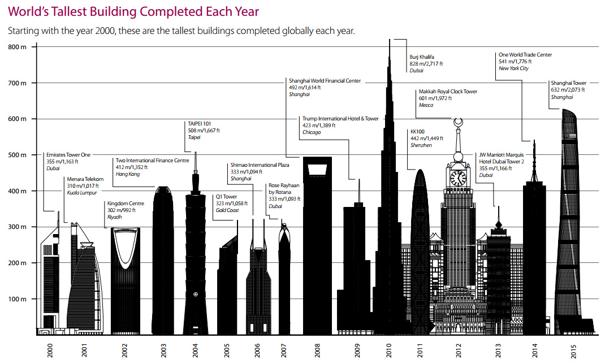

```{r setup, include=FALSE, message=FALSE, warning=FALSE}
knitr::opts_chunk$set(echo = FALSE)
library(dplyr)
library(ggplot2)
library(ggthemes)
library(knitr)
```

## Let scrap the skyscrapers


## [The Skyscraper Center](https://skyscrapercenter.com)
- Published the [100 Tallest Completed Buildings in the World by Height to Architectural Top]('https://skyscrapercenter.com/buildings')


## Tallest NOW
- [Burj Khalifa](https://skyscrapercenter.com/building/burj-khalifa/3)


---

```{r}
tall100 = read.table('data/tall.txt', header=FALSE, sep='|', na.strings=(NA))
colnames(tall100) = c(
'hgtRank', 'hgtFeet', 'blgName', 'blgCity', 'blgCountry',
'blgFloor', 'blgPurpose', 'isMultiPurpose', 'forOffice', 'forResidential',
'forHotel', 'forRetail', 'yrPropose', 'yrStart', 'yrComplete',
'tmProposeStart', 'tmProposeComplete', 'tmStartComplete'
)
colnames(tall100)
summary(tall100)
```

---


## A few thoughts

Two out of three ain't bad, right?  But, I won't conclude the formula is a fact, as I think the asian adult sample in 1994 *Adult* dataset (895) seems too small.  A conclusion should be drawn after explored more samples from multiple years.

As an asian myself, I listen and obey my parents as they always want the best for me.  Most things change as time evolves; thus, it is reasonable to say very few things hold true forever.  But, parents' care for their children never change.  

You may ask, "Are you sure?"  **"Yes, because I told you so!!!"**

Sincerely, Conred Wang.

/Volumes/MACEXT/ext.NYC.DSA/bootcamp007_project/Project3-WebScraping/conredwang
