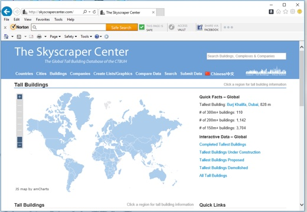
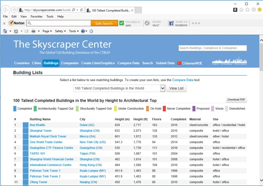
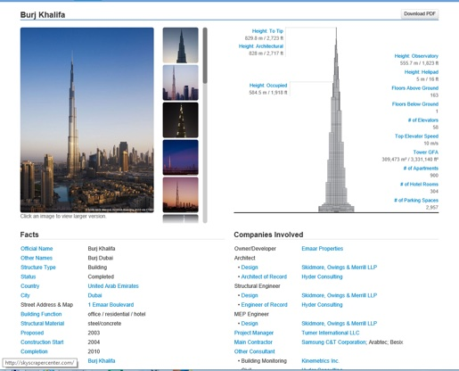
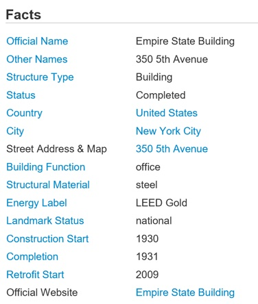
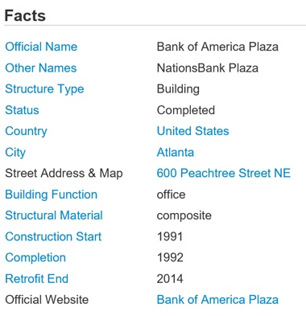

```{r setup, include=FALSE, message=FALSE, warning=FALSE}
knitr::opts_chunk$set(echo = FALSE)
library(dplyr)
library(ggplot2)
library(ggthemes)
library(knitr)
```

## Let <font color="green">scrap</font>e the sky<font color="green">scrap</font>ers using <font color="green">Scrap</font>y
<br>
[The Skyscraper Center](https://skyscrapercenter.com) publishes various information about world's skyscrapers.  For example,the [100 Tallest Completed Buildings in the World by Height to Architectural Top](https://skyscrapercenter.com/buildings).

## [100 Tallest Completed Buildings in the World by Height to Architectural Top](https://skyscrapercenter.com/buildings) 
The page even includes a downloadable PDF: <br>


## Tallest now is [Burj Khalifa](https://skyscrapercenter.com/building/burj-khalifa/3)
However, some data, like year Proposed and Construction Start, only available in secondary pages:<br>


## <font color="green">Scrapy</font> can help
<br>
Sorry, not that (above) <font color="green">Scrap</font>p<font color="green">y</font>, but this (below) <font color="green">Scrapy</font><br>


```{r, echo=FALSE}
tall100 = read.table('data/tall.txt', header=FALSE, sep='|', na.strings=(NA))
colnames(tall100) = c(
'hgtRank', 'hgtFeet', 'blgName', 'blgCity', 'blgCountry',
'blgFloor', 'blgPurpose', 'isMultiPurpose', 'forOffice', 'forResidential',
'forHotel', 'forRetail', 'yrPropose', 'yrStart', 'yrComplete',
'tmProposeStart', 'tmProposeComplete', 'tmStartComplete'
)
```
---
```{r}
ggplot(tall100,aes(x=blgCountry,y=..count..)) + 
  geom_bar(aes(fill=blgCountry)) + theme(legend.position="none") + xlab("Country") + 
  geom_text(stat="count", aes(label=..count..,y=..count..),vjust=-0.2) +
  ggtitle("Now, China (CN) has more tallest skyscrapers than other countries")
```   

##
ct cc country        | ct cc country     | ct cc country
---------------------|-------------------|-------------------
<font color="red">21 AE Arab Emirates</font>  | 01 AU Australia   | <font color="red">45 CN China</font>
01 GB United Kingdom | 01 KR South Korea | 01 KW Kuwait 
03 MY Malaysia       | 03 RU Russia      | 02 SA Saudi Arabia
02 TH Thailand       | 02 TW Taiwan      | <font color="red">17 US USA</font>
01 VN Vietnam        |                   |

## Statistics about these 100 skyscrapers:

* Usages
    + `r length(tall100$isMultiPurpose[tall100$isMultiPurpose=='Y'])` are multipurpose.
    + `r length(tall100$forOffice[tall100$forOffice=='Y'])` are used for office.
    + `r length(tall100$forHotel[tall100$forHotel=='Y'])` are used for hotel.
    + `r length(tall100$forResidential[tall100$forResidential=='Y'])` are used for residential.
    + `r length(tall100$forRetail[tall100$forRetail=='Y'])` are used for retail. 
<br>    
* Totals
    + `r sum(tall100$blgFloor)` floors.
    + `r sum(tall100$hgtFeet)` feet.
<br>

## Time
* `r sum(is.na(tall100$yrPropose))` do not have Proposed Year listed.
* `r sum(is.na(tall100$yrStart))` do not have Construction Start Year listed.
* From Proposed To Construction Start:
    + Cannot compute `r sum(is.na(tall100$tmProposeStart))`.
    + Shortest took `r min(tall100$tmProposeStart[!is.na(tall100$tmProposeStart)])` year.
    + Longest  took `r max(tall100$tmProposeStart[!is.na(tall100$tmProposeStart)])` year.
* <font color="red">From Construction Start To Complete:</font> 
    + Cannot compute `r sum(is.na(tall100$tmStartComplete))`.    
    + <font color="red">Shortest took<em> `r min(tall100$tmStartComplete[!is.na(tall100$tmStartComplete)])` </em>year.</font>
    + Longest  took `r max(tall100$tmStartComplete[!is.na(tall100$tmStartComplete)])` year.

<font color="red">One year to build a skyscraper! Really?</font>

## No kidding. Actually there are 2 :



##
<br>


Please check my blog [Let Scrape the Skyscrapers using Scrapy](http://blog.nycdatascience.com/student-works/let-scrape-skyscrapers-using-scrapy/) for more information on using Scrapy.

Best wishes, <br>
Conred Wang.

