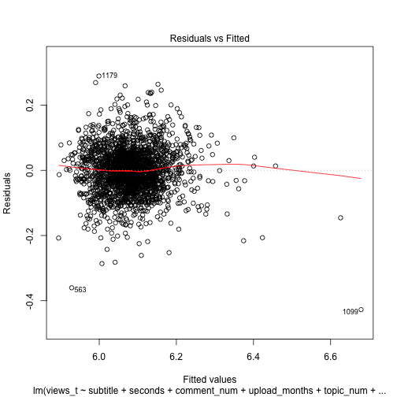

```{r setup, include = FALSE}
knitr::opts_chunk$set(echo = T)
```

### Compare the means of one topic and others
        
        
#### F-test:
        
##### All other F-tests return significant p-values, except for topic "Entertainment"
        
```
F = 0.94745, num df = 1220, denom df = 1012, p-value = 0.3681
```
        
##### Two sample T-test: alternative = "greater"
        
```
t = 0.76662, df = 2134.3, p-value = 0.2217
```
        
```
Means of Views between Entertainment and Non-Entertainment topics have no significant difference.
Entertainment is not a topic that will affect the view times significantly.
```
        
        
***
        
        
### Multiple linear regression
        
                
#### Calculate lambda to transform Y: normal distribution

```
lambda = -0.14
views.normalized = (views^lambda -1)/lambda
```
        
        
#### Model.Full: inluding all the variables

```{r eval = F}
summary(model.full)
```

```

lm(formula = views.normalized ~ Subtitle Number + Video Duration + 
    Comment Number + Months Since Uploaded + Topic Variety + 
    Business + Entertainment + Health + Psychology +
    Science + Technology + Global, data = tedtalk)
 
Residuals:
     Min       1Q   Median       3Q      Max 
-0.42738 -0.04159  0.00009  0.04255  0.28930 
 
Coefficients:
                         Estimate Std. Error t value Pr(>|t|)    
(Intercept)             5.822e+00  1.084e-02 537.260  < 2e-16 ***
Subtitle Number         7.557e-03  2.516e-04  30.037  < 2e-16 ***
Video Duration          9.049e-05  5.528e-06  16.368  < 2e-16 ***
Comment Number          8.031e-05  6.006e-06  13.371  < 2e-16 ***
Months Since Uploaded  -1.024e-03  5.064e-05 -20.216  < 2e-16 ***
Topic Variety          -3.359e-04  5.108e-04  -0.658 0.510847    
Business1               1.453e-02  3.869e-03   3.757 0.000176 ***
Entertainment1          1.827e-02  3.308e-03   5.522 3.74e-08 ***
Health1                -1.279e-02  4.421e-03  -2.893 0.003856 ** 
Psychology1             1.893e-02  3.423e-03   5.530 3.57e-08 ***
Science1                6.668e-03  3.470e-03   1.921 0.054824 .  
Technology1             6.628e-03  3.321e-03   1.996 0.046064 *  
Global1                -1.734e-02  3.603e-03  -4.812 1.59e-06 ***
 
Signif. codes:  0 ‘***’ 0.001 ‘**’ 0.01 ‘*’ 0.05 ‘.’ 0.1 ‘ ’ 1
 
Residual standard error: 0.07158 on 2221 degrees of freedom
Multiple R-squared:  0.4887,	Adjusted R-squared:  0.486 
F-statistic: 176.9 on 12 and 2221 DF,  p-value: < 2.2e-16
```
        
        
```{r eval = FALSE}
plot(model.full)
```




        
        
```{r eval = FALSE}
vif(model.full)
```

```
Subtitle Number    Video Duration     Comment Number    Months Since Upload    Topic Variety  
1.665957           1.477038           1.324943          1.228622               1.797021     
    
Business    Entertainment    Health      Psychology    Science     Technology    Global 
1.087478    1.182492         1.157342    1.254213      1.278845    1.199838      1.170642
```
        
        
```{r eval = FALSE}
avPlots(model.full)
```
          
            
***
        
          
#### Stepwise Regression
        
        
##### Based on AIC
```
Step:  AIC=-11770.63
views.normalized ~ Subtitle Number + Comment Number + Months Since Uploaded + Video Duration + 
     Entertainment + Psychology + Global + Business + Health + Technology + Science
 
                 Df Sum of Sq    RSS    AIC
<none>                        11.381 -11771
+ Topic Variety   1 0.0022157 11.379 -11769
```
        
        
##### Based on BIC
```
Step:  AIC=-11709.36
views.normalized ~ Subtitle Number + Comment Number + Months Since Uploaded + Video Duration + 
     Entertainment + Psychology + Global + Business + Health
 
                 Df Sum of Sq    RSS    AIC
<none>                        11.423 -11709
+ Technology      1  0.024902 11.398 -11706
+ Science         1  0.023349 11.399 -11706
+ Topic Variety   1  0.002751 11.420 -11702
```
        
        
***
        
        
### Conclusion: Support BIC

```
views.normalized ~ Subtitle Number + Comment Number + Months Since Uploaded + Video Duration + 
     Entertainment + Psychology + Global + Business + Health
     
Residuals:
     Min       1Q   Median       3Q      Max 
-0.42342 -0.04178  0.00017  0.04256  0.28739 

Coefficients:
                         Estimate Std. Error t value Pr(>|t|)    
(Intercept)             5.830e+00  1.009e-02 577.611  < 2e-16 ***
Subtitle Number         7.511e-03  2.453e-04  30.621  < 2e-16 ***
Comment Number          7.960e-05  5.996e-06  13.277  < 2e-16 ***
Months Since Uploaded  -1.001e-03  4.963e-05 -20.173  < 2e-16 ***
Video Duration          8.987e-05  5.528e-06  16.258  < 2e-16 ***
Entertainment           1.700e-02  3.148e-03   5.398 7.45e-08 ***
Psychology              1.727e-02  3.143e-03   5.493 4.40e-08 ***
Global                 -1.951e-02  3.390e-03  -5.754 9.92e-09 ***
Business                1.331e-02  3.770e-03   3.531 0.000423 ***
Health                 -1.239e-02  4.222e-03  -2.934 0.003385 ** 
---
Signif. codes:  0 ‘***’ 0.001 ‘**’ 0.01 ‘*’ 0.05 ‘.’ 0.1 ‘ ’ 1

Residual standard error: 0.07167 on 2224 degrees of freedom
Multiple R-squared:  0.4868,	Adjusted R-squared:  0.4847 
F-statistic: 234.4 on 9 and 2224 DF,  p-value: < 2.2e-16
```