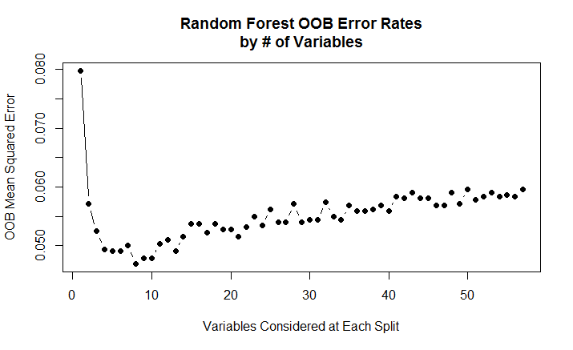
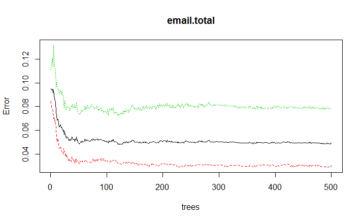
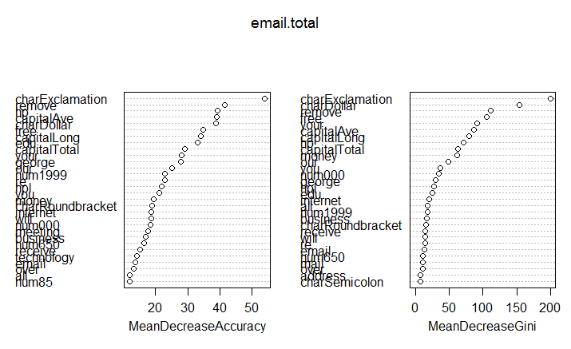

```{r setup, include=FALSE}
knitr::opts_chunk$set(echo = TRUE)
library('kernlab')
library(ggplot2)
library(dplyr)
library(tree)
library(caret)
library(VIM)
library(corrplot)
data(spam)
```

## EDA 

```{r}
## Summary functions of Spam Emails:
dim(spam)
colnames(spam)
summary(spam)
head(spam)
```

## SPAM dataset is complete (no NAs!!)
```{r}
aggr(spam) ## no missingness
```

##Correlation Analysis
Used the caret function 'findCorrelation' to identify highly correlated predictors. Goal was to determine which of these predictors would not be considered signficant for model prediction in Random Forest.

```{r}
Cor<-cor(spam[,-58])
HhighCorr<-findCorrelation(Cor, cutoff=0.50) 
LhighCorr<-findCorrelation(Cor, cutoff=0.25)

M2 <- cor(spam[,HhighCorr])
M3 <- cor(spam[,LhighCorr])
corrplot.mixed(M3, upper = "circle", order="hclust")

corrplot.mixed(M2, upper = "circle", order="hclust")
ggplot(data=spam, aes(num415, num857)) + geom_point()
```


## Box Plots
```{r}
## Box Plots
spam2 = spam %>% select(your, you, all, our, will, type)
for(i in 1:5){
  g2 = ggplot(spam2, mapping = aes(x=type, y=spam2[,i], fill=type))
  g2_plot = g2 + geom_boxplot() + 
    xlab(names(spam2)[i]) + ggtitle(paste0("Boxplot of ", names(spam2)[i]))
  print(g2_plot)
}
names(spam2)[1]
```

## Bar Plot of Type
```{r}
g = ggplot(spam, mapping = aes(x=type, fill=type))
g + geom_bar()
```

## Trees
Error in tree(type ~ ., split = "gini", data = spam.train) : 
  maximum depth reached
  
Doing a normal tree doesn't make sense -- there are too many terminal nodes...
R won't let you proceed as the maximum depth is reached.


## Random Forest
```{r eval=FALSE}
##################################
#####Bagging & Random Forests#####
##################################
library(randomForest)


#Splitting the data into training and test sets by an 70% - 30% split.
set.seed(0)
train = sample(1:nrow(spam), 7*nrow(spam)/10) #Training indices.
spam.test = spam[-train, ] #Test dataset.
type.test = type[-train] #Test response.

#Fitting an initial random forest to the training subset.
set.seed(0)
email = randomForest(type ~ ., data = spam, subset = train, importance = TRUE)
email


#The MSE and percent variance explained are based on out-of-bag estimates,
#yielding unbiased error estimates. The model reports that mtry = 4, which is
#the number of variables randomly chosen at each split. Since we have 13 overall
#variables, we could try all 13 possible values of mtry. We will do so, record
#the results, and make a plot.

#Varying the number of variables used at each step of the random forest procedure.
set.seed(0)
oob.err = numeric(57)
for (mtry in 1:57) {
  fit = randomForest(type ~ ., data = spam[train, ], mtry = mtry)
  oob.err[mtry] = fit$err.rate[500]
  cat("We're performing iteration", mtry, "\n")
}

#Visualizing the OOB error.
plot(1:57, oob.err, pch = 16, type = "b",
     xlab = "Variables Considered at Each Split",
     ylab = "OOB Mean Squared Error",
     main = "Random Forest OOB Error Rates\nby # of Variables")

#Can visualize a variable importance plot.
importance(email)
varImpPlot(email)

min.mtry = 8
set.seed(0)
email.total = randomForest(type ~ ., data = spam, mtry = min.mtry, subset = train, importance = TRUE)


#Ftting and visualizing a classification tree to the training data.
plot(email.total)
text(email.total, pretty = 0)
summary(email.total)
email.total

importance(email.total)
varImpPlot(email.total)
#Using the trained decision tree to classify the test data.
tree.pred = predict(email.total, spam.test, type = "class")
tree.pred

#Assessing the accuracy of the overall tree by constructing a confusion matrix.
table(tree.pred, spam.test$type)
(50 + 27)/(807 + 497 + 50 + 27)
```





## Performance of Random Forest:
email.total

Call:
 randomForest(formula = type ~ ., data = spam, mtry = min.mtry,      importance = TRUE, subset = train) 
               Type of random forest: classification
                     Number of trees: 500
No. of variables tried at each split: 8

        OOB estimate of  error rate: 4.91%
Confusion matrix:
        nonspam spam class.error
nonspam    1895   59  0.03019447
spam         99 1167  0.07819905


> confusionMatrix(tree.pred, spam.test$type)
Confusion Matrix and Statistics

          Reference
Prediction nonspam spam
   nonspam     807   50
   spam         27  497
                                          
               Accuracy : 0.9442          
                 95% CI : (0.9308, 0.9558)
    No Information Rate : 0.6039          
    P-Value [Acc > NIR] : < 2e-16         
                                          
                  Kappa : 0.8826          
 Mcnemar's Test P-Value : 0.01217         
                                          
            Sensitivity : 0.9676          
            Specificity : 0.9086          
         Pos Pred Value : 0.9417          
         Neg Pred Value : 0.9485          
             Prevalence : 0.6039          
         Detection Rate : 0.5844          
   Detection Prevalence : 0.6206          
      Balanced Accuracy : 0.9381          
                                          
       'Positive' Class : nonspam  