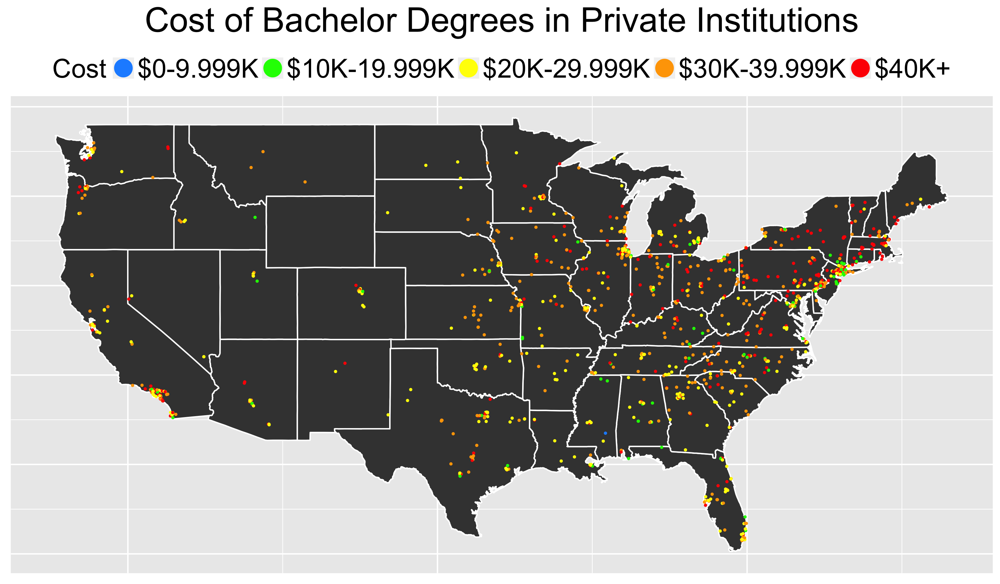
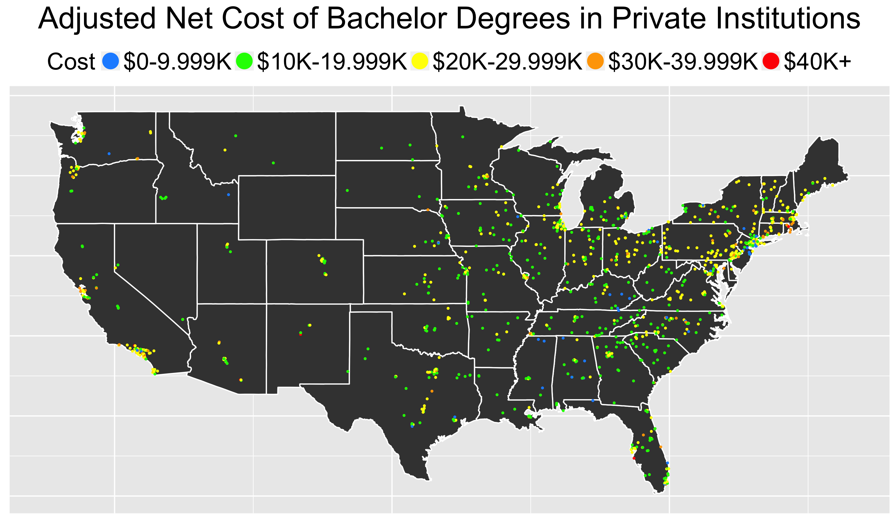

## Agenda
- Motivation
- Data Set
- Visualization
    + US Map of cost for Public/Private
    + US Map of net cost for Public/Private
    + Density graphs of debt and earnings
    + Scatter plot of net cost vs earnings
- Conclusion
- Next Steps

# Motivation

## Motivation

> - Recession of 2007-2009 forced many students to choose between public school and private school
> - Currently, tuition and student debt is on the raise
> - However, more jobs are requiring college degrees 
> - With so much money on the line, would you save it by going to Public school, or "invest" it in Private school?

# Data Set

## Data Set

- College data was released by the U.S Dept of Education and compiled by Kaggle
- Limiting the scope of this analysis to Predominately Bachelor Degree granting institions
- Only looking at money aspect (cost, debt, earnings)

# Visualization

## U.S Map of Cost
Cost of attendance, including tuition, fees, living, etc.
 
 

## U.S Map of Adjusted Net Cost
Net cost adjusted by average grants/scholarships
 
 

## Density of Debt and Earning

 
 
- The peaks for the debt graph are clearly separated
 
- However the peaks for the earnings are almost the same

## Scatter Plot of Net Cost vs Earning

## Scatter Plot of Net Cost vs Earning

# Conclusion

## Conclusion

- In general, the cost of private school is greater than public schools
- In general, salaries 10 years after graduation are about the same
- All else being equal, go to public school to save money

# Next steps

## Next steps

- Incorporate other factors such as size, faculty ratio, programs, etc.
- Use time information to see trends and stability of costs/earnings
- Find way to incorporate associate and other degrees
- Look at top ranking tier of colleges
- College vs university

#               Thank you! Questions?